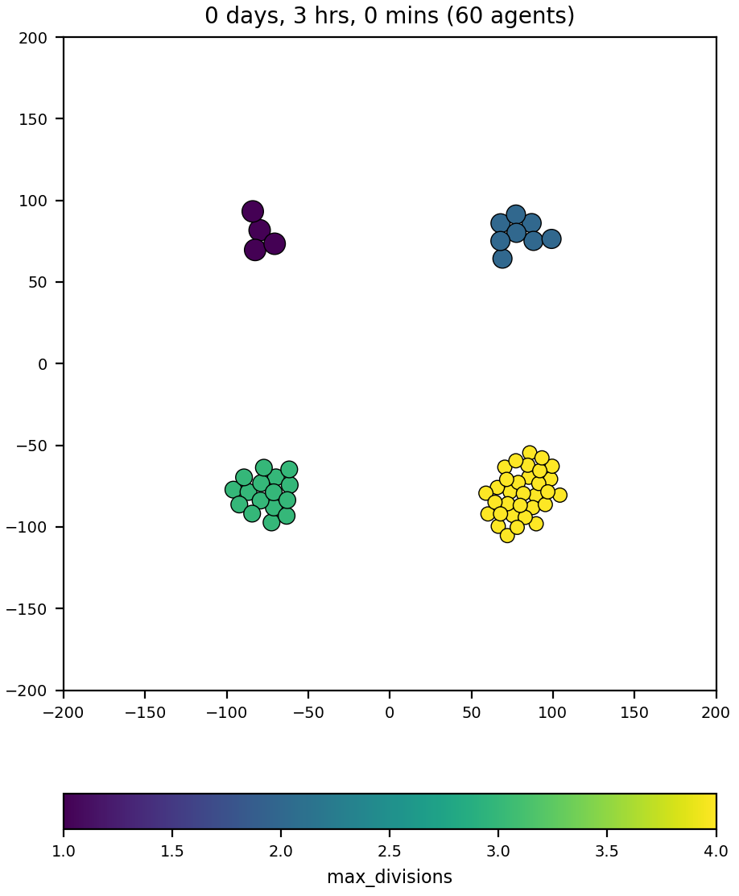

# Custom cell division: max # of divisions

Rf custom_modules/custom.cpp, `custom_division_function` function.

This repo also includes `/studio` (created via `python beta/get_studio.py`). After compiling to create the   project  executable, can run:
```
python studio/bin/studio.py
```


